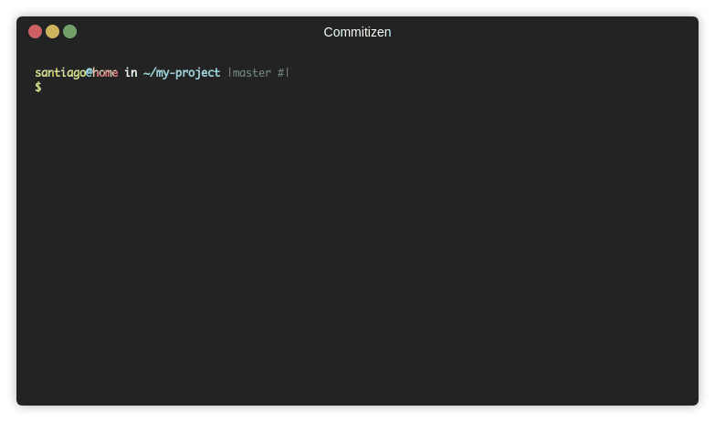

# pandabear

An runtime vschema validator for Pandas DataFrames.


[](https://github.com/psf/black)
[](https://pycqa.github.io/isort/)

[](https://github.com/pre-commit/pre-commit)

Generated from [Precis Python Package template](https://github.com/Precis-Digital/precis-python-package) (V 0.0.3) via [Cookiecutter](https://cookiecutter.readthedocs.io/en/latest/README.html)


**See package level [README.md](src/pandabear/README.md) for documentation and usage examples**


## Prerequisites:
- [python](https://www.python.org/downloadss/) and virtual environment manager of your choice
    - pip version > 21.0.0
- [Google Cloud SDK (gcloud)](https://cloud.google.com/sdk/gcloud)
  - Note, if this is your first time using gcloud, you can refer to their docs on [Installing](https://cloud.google.com/sdk/docs/install) and [Setting Up](https://cloud.google.com/sdk/docs/install) your environment. You may need to run the following commands to setup your local environment:
    - `gcloud init`
    - `gcloud auth application-default login`
    - `gcloud auth login YOUR-PRECIS-EMAIL --update-adc`
- [docker](https://docs.docker.com/get-docker/)


## Setup:
- Create/activate a virtual environment
- Run `make help` to see various helper commands to interact with the project
- Run `make setup` to install dependencies and setup the local package
- To make commits: run `make commit` or `make commit-all` (adds all changed files to git staged)
- To manually build and publish the package: `make build_publish_package`
- To setup automated building and publishing via Cloud Build:
  - Publish the Repo to GitHub
  - Run `make enable-update-cloudbuild` (one time to setup, can run again to update the settings if changed)
- To update files or folders from the source template:
  - Run `python scripts/update_template_components.py --files=xxx, --folders=x,y,z` (`--help` to show help text)


## Commitizen and Automated Versioning and Changelog
- A python package must have a version, here we use [semantic versioning](https://semver.org/) format (ex. 1.1.1)
- Instead of manually bumping a version, this template uses [commitizen](https://commitizen-tools.github.io/commitizen/) to auto-update the package version and auto-generate a CHANGELOG.md
- This automation is done by parsing commit history as you apply changes, using the [Conventional Commits](https://www.conventionalcommits.org/en/v1.0.0/) format of commit messages
- To auto-bump the version and generate a change log, [GitHub Actions](https://docs.github.com/en/actions/learn-github-actions/understanding-github-actions) is used on pushes to main/master branch, defined in [.github/workflows/bumpversion.yaml](.github/workflows/bumpversion.yaml). See CI/CD section for more details
- To enforce this commit message, commitizen is used as a pre-commit hook, and we highly recommend you use the commitizen CLI to make commits, you can run `make commit` or `make commit-all` helper commands, or can run things manually in below example
```bash
# Can run `make commit` or `make commit-all` helper command, or each command manually, listed below: 
# Optionally run pre-commit checks to ensure code formatting/linting is good
pre-commit run --all-files -v

# First add your specific files to git staged changes, or add all via '.'
git add .

# Then run cz commit and follow prompt to generate a good commit message
gz commit
```



## Misc.
- Author names and emails are specified in [setup.cfg](setup.cfg), the package template initially fills in these values from the git user who created the package, if a user doesn't have a git name specified a placeholder value is used and should be updated.
  - Multiple author names and emails can be specified, as a comma-separated list (ex. `author = Jason Lopez,Maya Lopez`)
- Specifying dependencies:
  - You must specify what dependencies your project needs to work in [setup.cfg (install_requires)](setup.cfg), preferably with wider-scope version constraints (eg. requests>=2.0.0 instead of requests==2.1.3)
- Publishing settings are in [gcp_package_config.yaml](gcp_package_config.yaml), here you can configure where your package is published to (which GCP Project and Artifact Registry Repo)
  - By default, the values are set to deploy to the "pd_core" repo in [precis-artifacts](https://console.cloud.google.com/artifacts/python/precis-artifacts/europe-west1/pd-core?authuser=0&orgonly=true&project=precis-artifacts&supportedpurview=organizationid), which all users in the Precis domain have read access to.
- You can tear down the project by running the [scripts/tear_down.sh](scripts/tear_down.sh) script - will delete all package versions as well as the Cloud Build Triggers if they exist. NOTE: It will not delete the GitHub Repository

## CI/CD:
GitHub Actions are used to automatically bump the version and update the [CHANGELOG.md](CHANGELOG.md) based on the commit messages since the last version (no action needed to enable or configure, settings in [.github/workflows/bumpversion.yaml](.github/workflows/bumpversion.yaml)).
Cloud Build can be used to automatically update your package version and publish to GCP [Artifact Registry](https://cloud.google.com/artifact-registry/docs), where the package can be installed from (must run two commands noted below to setup the build triggers).

- For adding CI/CD run below commands (note, you may be prompted to click a link to connect your repo to Cloud Build, one-time task):
    - `make enable-update-cloudbuild` (will create or update the Cloud Build triggers doing the automated tests and building-publishing of the package)
      - Optionally can manually run the two scripts below:
      - `./cloudbuild/create_update_run_tests_build_trigger.sh` create/updates GitHub Build trigger on Pull Request to master (or main) and will run tests and linting checks.
      - `./cloudbuild/create_update_build_publish_trigger.sh` create/updates GitHub Build trigger on pushes to version tags and will build and publish the package to GCP Artifact Registry
    - Configuration for the test and build/publish GitHub Cloud Build triggers are in `cloudbuild/run_tests_build_trigger.yaml` and `cloudbuild/publish_build_trigger.yaml`
    - Cloud Build makes use of same `build_publish_package.sh` and `run_tests.sh` scripts in [scripts](scripts) directory
- Files at [cloudbuild](cloudbuild) - for adding CI/CD to project, or using Cloud Build to deploy:
   - [run_tests_cloudbuild.yaml](cloudbuild/run_tests_cloudbuild.yaml) - Cloud Build configuration / steps for running tests and linting checks
   - [publish_build_cloudbuild.yaml](cloudbuild/publish_build_cloudbuild.yaml) - Cloud Build configuration / steps for building the python package and uploading to Artifact Registry

  
## Testing WIP Changes
You should write tests for your package, but you might want to test changes before releasing a new official version to Artifact Registry in a way that isn't covered by your tests.
For these cases you can install a package directly from a specific GitHub Tag or Branch by adding a `#BRANCH-NAME` or `@TAG-NAME` at end of git url, and optionally install the package as local code in a project with the `--target` flag.
- ex. `pip install git+ssh://git@github.com/Precis-Digital/my-package.git@v1.0.0 --target ./pd_core --upgrade`


## Notes / Docs:
- Uses:
    - [pre-commit](https://pre-commit.com/) for Git pre-commit hooks
    - [Black](https://github.com/psf/black) for python code formatting
    - [isort](https://github.com/PyCQA/isort) to sort imports
    - [gitleaks](https://github.com/zricethezav/gitleaks) for secrets scanning in pre-commit hooks and CI/CD
    - [pytest](https://pytest.org/) as test runner (can run both pytests and unittests)
        - [Unittest](https://docs.python.org/3/library/unittest.html)
    - [Coverage](https://coverage.readthedocs.io/en/coverage-5.3.1/) for assessing test coverage
    - [Commitizen](https://commitizen-tools.github.io/commitizen/) for enforcing correct git commit message format, auto-bumping versions, and auto-generating the change log
